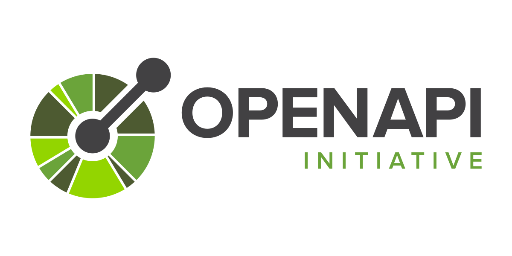
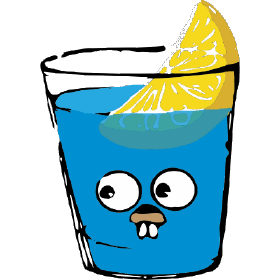

<h1 align="center">Moneta</h1>

Moneta is a Web-based application to manage our daily cashflow.

 

    

# Capstone Project Dicoding X Kampus Merdeka Batch 4

<h4> Kelompok: C23-M4001 </h4>
<h4> Tema: Solusi Utilitas </h4>
<h4> Nama Aplikasi: Moneta </h4>

 Durasi Pengerjaan Projek: 16 Mei 2023 - 16 Juni 2023 

### Latar Belakang:
Seiring berkembangnya kemajuan teknologi tidak hanya memiliki dampak positif, tetapi juga dampak negatif diantaranya semakin meningkatnya perilaku konsumerisme akibat kemudahan belanja online, mudahnya meminjam uang dengan bunga yang mencekik pada pinjaman online, hingga banyaknya investasi bodong [1]. Ditambah dengan adanya pandemi COVID-19 yang mengakibatkan penurunan pendapatan usaha dan PHK, hal-hal ini semakin berujung pada buruknya kondisi keuangan yang dialami oleh hampir sepertiga masyarakat generasi Z dan Y pada tahun 2021. 

Sebagian masyarakat juga menyatakan bahwa pengeluaran bulanan selama setahun terakhir lebih besar dari pendapatan yang dimiliki [2]. Selain itu, tingkat literasi keuangan masyarakat Indonesia pada tahun 2022 juga masih terbilang cukup rendah, yakni sebesar 49,8% [3]. Poin-poin tersebut menunjukkan bahwa masyarakat belum menerapkan pengelolaan keuangan yang baik sehingga diperlukan sebuah tool untuk memantau alur keuangan. 

Dalam hal ini, kami berencana membuat aplikasi berbasis website yang mencakup pencatatan keuangan bernama Moneta yang merepresentasikan koin pertama Bangsa Romawi, kuil tempat pembuatan pertama koin tersebut, dan gelar ketiga Dewi Juno sebagai dewi penjaga uang serta kekayaan [4]. Tim kami ingin menjawab pertanyaan-pertanyaan, seperti bagaimana orang lebih mudah mengelola keuangan pribadi dan fitur apa saja yang dibutuhkan untuk aplikasi pengelolaan keuangan yang efektif.

## Project Management
| Jira by Atlassian |
| --- |
|  |

## UI / UX
| Figma |
| --- |
|  |

## Deployment
| Nginx | Docker | Redoc | OpenApi | Digital Ocean Droplet | Github |
| --- | --- | --- | --- | --- | --- |
|  |  |  |  |  |  |

## Frontend
| ReactJS | TailwindCSS | React Query | MomentJs | React Router DOM | EsLint | Github |
| --- | --- | --- | --- | --- | --- | --- |  
|  |  |  |  |  |  |  |

## Backend
| Golang | PostgreSQL | JWT | Gin | Github |
| --- | --- | --- | --- | --- |
|  |  |  |  |  |

## Contributors
| 
  <a href="https://github.com/david-yappeter"><h5>David Yappeter</h5></a> 
 | 
  <a href="https://github.com/dimyatimaulana"><h5>Maulana Dimyati</h5></a> 
 | 
  <a href="https://github.com/asyasqiaz"><h5>Annisa Syasqia Zain</h5></a> 
 | 
  <a href="https://github.com/fiorezarn1902"><h5>Fioreza Radhin Naufal</h5></a> 
 |
| --- | --- | --- | --- |

# Special Thanks

